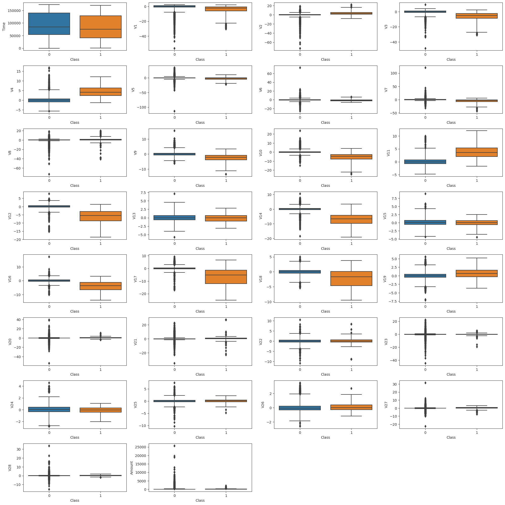
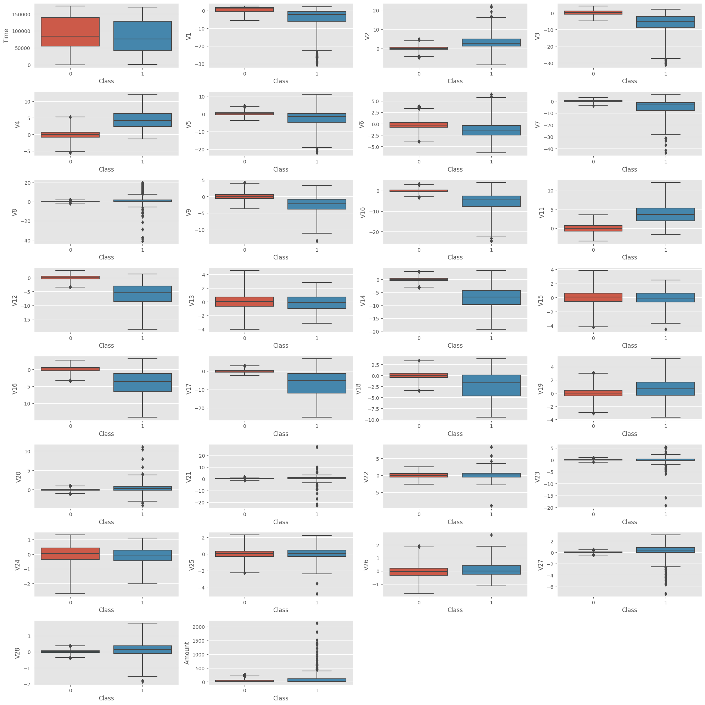
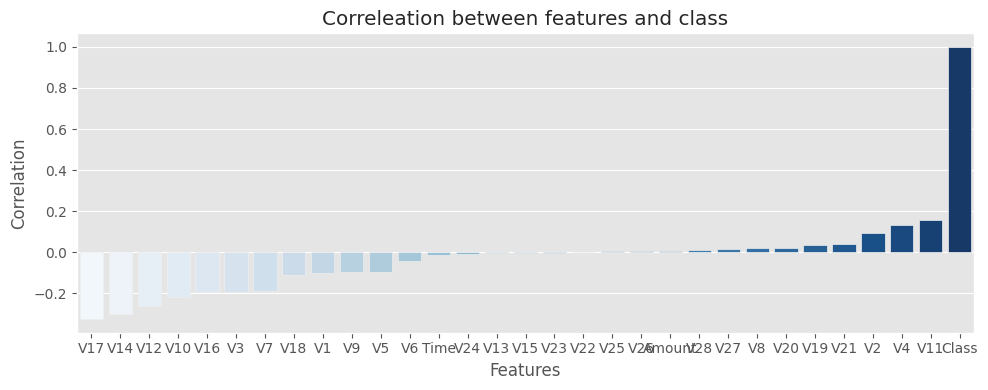
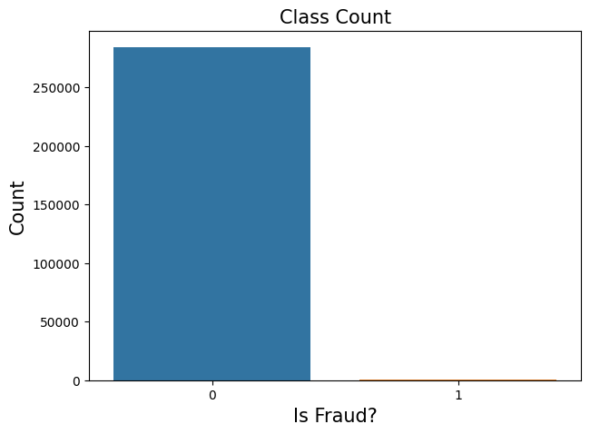
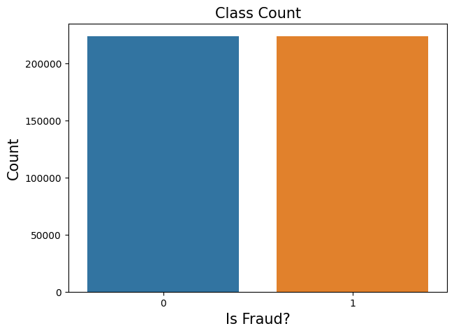
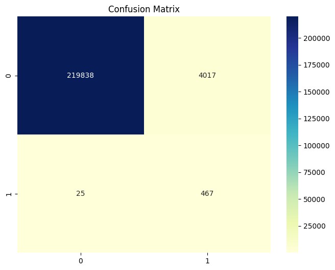
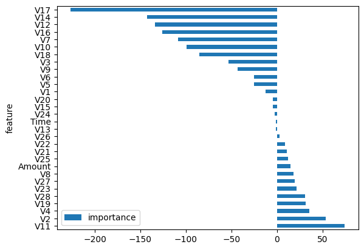

# Credit-Card-Fraud-Detection
### About The Project
A model has been developed that finds anonymized credit card transactions that have been labeled as fake or real. In this project, various images were obtained by analyzing data and a prediction model was created with Logistic Regression. With pip install requirements_linux.txt , you can install the modules and libraries used with their versions.

### About Data
The dataset contains transactions made by credit cards in September 2013 by European cardholders.
This dataset presents transactions that occurred in two days, where we have 492 frauds out of 284,807 transactions. The dataset is highly unbalanced, the positive class (frauds) account for 0.172% of all transactions.

It contains only numerical input variables which are the result of a PCA transformation. Unfortunately, due to confidentiality issues, we cannot provide the original features and more background information about the data. Features V1, V2, … V28 are the principal components obtained with PCA, the only features which have not been transformed with PCA are 'Time' and 'Amount'. Feature 'Time' contains the seconds elapsed between each transaction and the first transaction in the dataset. The feature 'Amount' is the transaction Amount, this feature can be used for example-dependant cost-sensitive learning. Feature 'Class' is the response variable and it takes value 1 in case of fraud and 0 otherwise.

### Built with
* Python

### Some Visualizations

* As seen from the boxplots, there are many outliers in the data;




* IQR calculated and outliers removed from data. Boxplots after IQR operations;




* According to the target variable, you can examine the distribution plots of the features from the plot results. (visualization_results folder)


* If we look at the correlation between the target and the features, we can see that the V17, V14, V12 and V11 features are highly correlated with the target value. 




* Dataset too unbalanced;




* The Smote operation was applied before training the data. Target distribution after Smote;



* More detailed plots can be viewed in the visualization_results folder.

### Model and Train
The LogisticRegressionTrainer class was created using the object-oriented program in the logisticregression.py.py file. It can be tested and visualized and results  using the --is_testing --visualize_log_results and arguments. After the train process, the model is saved in the saved_model folder with the .pkl extension.``` python3 train.py --is_testing  --data "your_data" --visualize_log_results```

--is_testing outputs; 
confusion_matrix:
      [[65970  1187]
 		  [ 2918 64238]], 

accuracy_score:0.9694370611928853
recall_score:0.9565489308475787,
roc_auc_score:0.9694369652376584
precision_score=0.9818570882690103, 
f1_score:0.9690377957625904

### Test Results

Confussion Matrix;




Feature Importance;




### Production
Api was created with Flask in app.py file. 
In the test.py file, the data in xml format was parsed and the predictions were taken as a dataframe and api control was performed.
